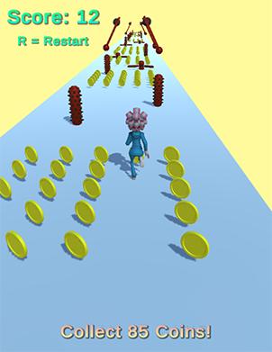

# 3D Runner Game

This is a simple 3D Runner game developed using Unity game engine. The objective of the game is to guide the character to reach the end of the path by touching the screen and dragging your finger left or right.

## Play

- [Itch.io](https://gr4ndsmurf.itch.io/run-granny-run)

## Gameplay

- The player can control the character's movement by swiping left or right on the screen. The character will move horizontally within the given limit.
- The character automatically moves forward at a constant speed.
- Collect coins scattered along the path to increase your score. The goal is to reach the end of the path with the highest score possible.
- Be careful not to collide with obstacles along the way. Colliding with an obstacle will restart the level.
- If the player successfully reaches the end of the path and collects enough coins, the player wins. Otherwise, the player loses the game.

## Scripts

### CamFollowPlayer.cs

This script is responsible for smoothly following the player's movement and looking at a designated target.

### CollectCoin.cs

This script handles coin collection, score tracking, and game win/lose conditions. When the player collects all coins and reaches the end of the path, the game will end with the appropriate animation.

### PlayerController.cs

The PlayerController script enables the player to control the character's movement using touch input. It also handles player movement within the specified horizontal limit.

## How to Play

1. Download or clone the repository.
2. Open the project in Unity.
3. Navigate to the `Scenes` folder and open the main game scene.
4. Ensure that the scene's Camera has the `CamFollowPlayer` script attached.
5. Press the Play button in the Unity Editor to start the game.
6. On mobile or touch-enabled devices, touch the screen and drag left or right to control the character's movement.
7. Collect as many coins as possible while avoiding obstacles to achieve a high score.
8. Reach the end of the path to win the game.
